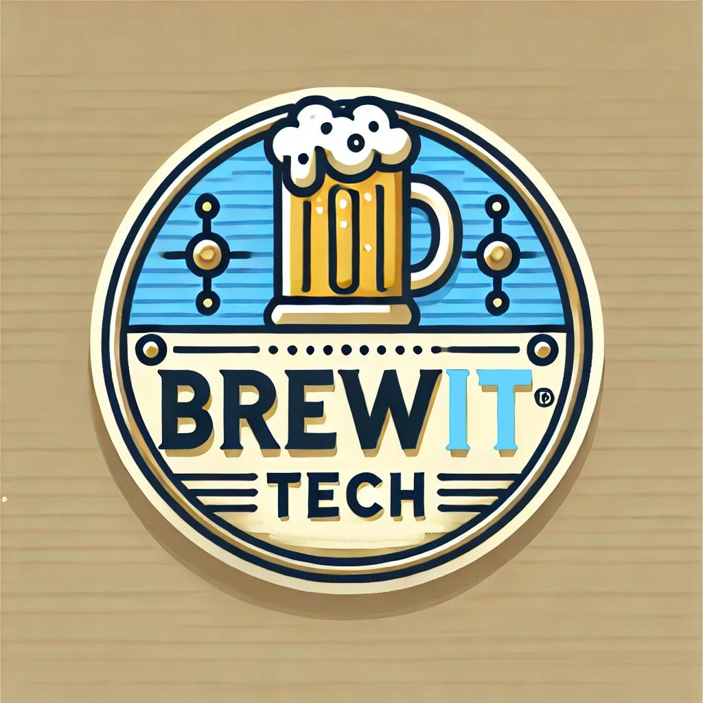

# Förarbete

## Vilka är vi?

BrewIT är ett nystartat företag grundat av två entusiaster med inriktning på att bygga IT-miljöer. Med bred kompetens inom serverhantering och nätverkslösningar levererar vi skräddarsydda, säkra och kostnadseffektiva lösningar som möter våra kunders behov.

Tillsammans med oss får ni en IT-miljö som inte bara är robust och pålitlig, utan också anpassad för framtidens behov.

## Varför lämnar vi offert?

Under en trevlig afterwork träffade vi Stefan, Anna-Karin och Charlie, grundarna av det nystartade företaget DesignDreamers. Efter att ha drivit webbdesign som en hobby under en tid fick de sitt första riktiga uppdrag – att designa en hemsida åt ett externt företag. Detta blev startskottet för att omvandla deras passion till ett professionellt företag.

Men med den här omställningen kommer nya krav. Deras tidigare hobbybaserade IT-lösning är inte längre tillräcklig för att stödja deras växande verksamhet. För att hantera det ökade arbetsflödet och möjliggöra framtida expansion behöver de en skalbar och pålitlig IT-miljö som kan möta deras nuvarande och kommande behov.

Efter en givande diskussion med DesignDreamers har BrewIT tagit fram en offert som fokuserar på att bygga en säker och robust IT-infrastruktur. Vår lösning hjälper dem att ta nästa steg i sin resa – från hobbyprojekt till ett framgångsrikt och professionellt företag.

## Behov/Önskemål

DesignDreamers har specificerat följande behov och önskemål för sin framtida IT-miljö:

**Central identitetshantering:** En lösning för att hantera användaridentiteter och autentisering på ett centraliserat och säkert sätt.

**Behålla befintliga Linux-datorer:** Deras nuvarande Linux-baserade arbetsstationer ska fortsätta användas som en del av den nya miljön.

**Möjlighet att använda Windows-datorer:** Flexibilitet att lägga till och använda Windows-datorer i IT-miljön.

**Enhetlig autentisering:** Möjlighet för användare att logga in med samma konto för åtkomst till flera tjänster, vilket förbättrar användarupplevelsen och effektiviteten.

**Kostnadseffektivitet:** Maximal återanvändning av befintlig IT-utrustning för att hålla kostnaderna nere.

## Nuläge

DesignDreamers nuvarande IT-miljö består av:

<ol>
<li>Tre Linuxbaserade arbetsstationer.</li>
<li>Två Linuxbaserade servrar:</li>
<ul>
<li>Databasserver – Hanterar data för WordPress.
<li>Webbserver – Presentation av designer.
</ul>
</ol>

De har förberett ett nytt kontor i Solna med tillräckligt utrymme för alla anställda. Kontoret är redo att stödja verksamheten och tillväxten framöver. Det är utrustat med en snabb fiberanslutning på 250/250 Mbit.

## Vår lösning

Vi på BrewIT föreslår en lösning där vi använder de två befintliga fysiska servrarna för att dela upp dem i flera virtuella servrar. 

De användare som redan har en Linux-dator kan fortsätta använda sina datorer, men byter till centralt administrerade konton. Vi har en lösning för att ansluta datorer till företagets interna miljö.

Genom att återbruka existerande utrustning håller vi kostnaderna nere.

Det måste införskaffas en brandvägg och ett ytterligare nätverkskort för att separera Webbservern från företagets interna miljö och från hot på internet.

Linuxklienterna behöver en Ubuntu Pro subscription licens. Det krävs för att centralt kunna administrera dem.

Varje fysisk server kräver en Windows Server Standardlicens på grund av behovet av virtuella maskiner.

## Teknisk specifikation

Antar DesignDreamers vår offert så får de:

En IT-miljö med två domän kontrollanter som replikerar mellan varandra för ökad felsäkerhet, samt en brandvägg för att motverka yttre hot från att ta sig in i företaget.

Server 1 - OS: Windows Server X
    <ul>
    <li>VM1 - Domain Controller 1
    <li>VM2 - Database
    </ul>

Server 2 - OS: Windows Server X
    <ul>
    <li>VM1 - Domain Controller 2
    <li>VM2 - WordPress
    <li>Extra NIC for DMZ
    </ul>

Firewall - "Modell"

De får också ett antal script för att hjälpa till att sätta upp de olika servrarna enligt en standardmall och utföra vissa funktioner; som att importera användare från en fördefinierad csv-fil och konfigurera Linux-klienter för att ansluta till domänen.

Vi kommer också lämna över en teknisk dokumentation för hur miljön är konfigurerad. Så att de själva kan bygga vidare på miljön i framtiden.

Server 1: virtuella servrar: AD, databas

Server 2: viruella servrar: AD, wordpress
två nätverkskort så hemsidan hamnar på ett separat DMZ

Linuxdatorer ansluter genom ett script som installerar och ansluter datorn till domänen.
Program som används är: realmd, sssd, sssd-tools, libnss-sss, adcli, krb5-user, adsys.

Användare importeras med ett script från listan över anställda så alla får varsitt konto. Även särskilda konton för administration av miljön skapas.

Strukturen i AD ser ut såhär: "bild"

Företagsmail hanteras i Azure

+. Design Dreamers har planer på att utöka sin miljö till att även omfatta Windows datorer, då nyanställda förväntas kunna hantera dessa lättare.

Vi på BrewIT föreslår en lösning med två maskiner med virtuella servrar på, då är det möjligt att ha olika servrar med olika operativsystem och roller, till en lägre kostnad.

Webbdesignsföretaget DesignDreamers är ett nystartat företag som bestämt sig för att "gå pro", för drt behöver de anställa ett antal personer och ha en strukturerad IT-miljö. De har tagit på sig ett uppdrag för att designa ett externt företags hemsida och 